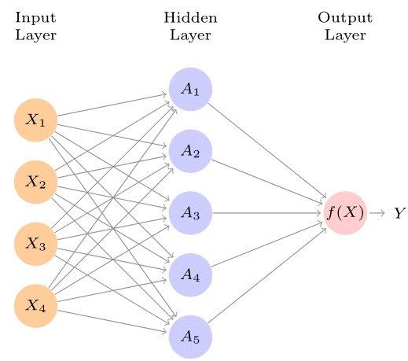
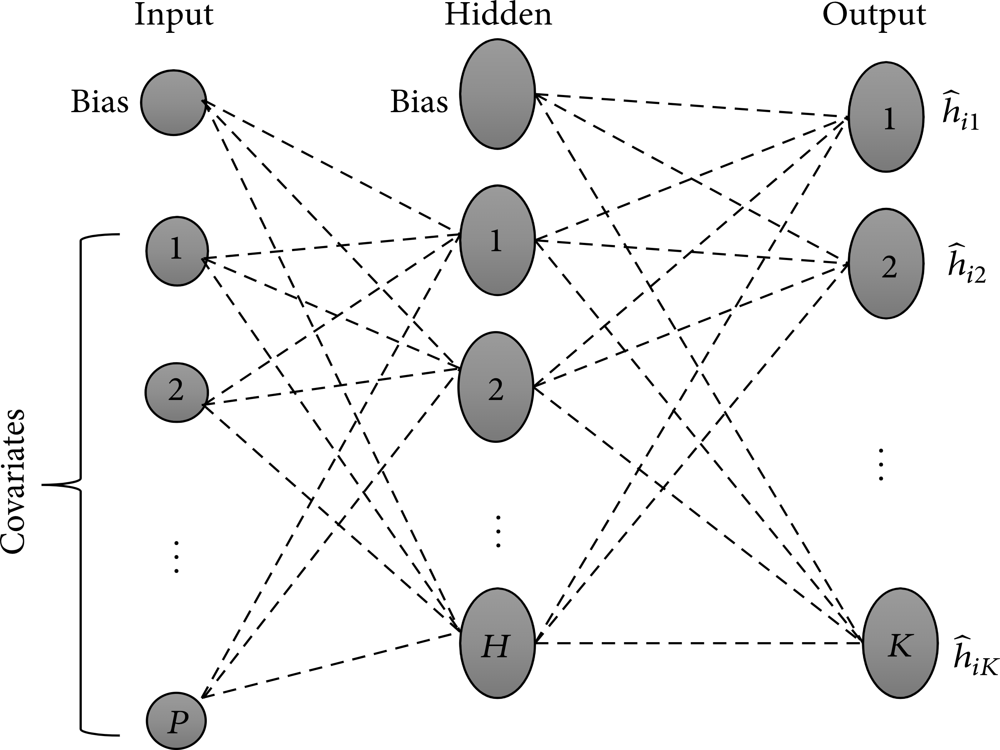

```{r setup, include=FALSE}
options(java.parameters = "-Xmx15g")

knitr::opts_chunk$set(warning=FALSE,
                      message=FALSE,
                      echo=T,
                      dpi=300,
                      error=FALSE)
 
# Evaluate the figure caption after the plot
#knitr::opts_knit$set(eval.after='fig.cap')
 
# Use the table counter that the htmlTable() provides
options(table_counter = TRUE)
 
# Use the figCapNo() with roman letters
#options(fig_caption_no_roman = TRUE)
#options(kableExtra.latex.load_packages = F)

# Then install the Grmd-package by running below code:
#devtools::install_github("gforge/Grmd")


# function to install missing packages
ipak <- function(pkg){
  new.pkg <- pkg[!(pkg %in% installed.packages()[, "Package"])]
  if (length(new.pkg))
    install.packages(new.pkg, dependencies = TRUE, repos='http://cran.rstudio.com/')
  sapply(pkg, require, character.only = TRUE)
}

#install.packages('package_name', dependencies=TRUE, repos='http://cran.rstudio.com/')

packages =c( "tidyverse","knitr", "kableExtra","skimr", "MatchIt", "RItools","optmatch", "ggplot2", "tufte", "tufterhandout", "plotly", "snowfall", "rstan")

ipak(packages)
```

```{r echo=FALSE}
bytes <- file.size("index.Rmd")
words <- bytes/10
minutes <- words/200
```

<center>
**Reading Time: `r round(minutes)` minute(s)**
</center>
<br>

<figure>
  <center>
    
    <figcaption>Image Source:[Eric Lee](https://iveybusinessjournal.com/the-reality-of-artificial-intelligence/) </figcaption>
  </center>
</figure>

# Motivation

Accurate predictions of prognostic outcomes are of substantial and pivotal significance in the context of quality care delivery. However, the application of deep learning models to enhance caregiving in healthcare has been limited by concerns related to the reliability of such methods. In this way, models that are robust and which can result in a throughput prediction of such clinical outcomes as survival while at the same time exhibiting high reliability and potential to be generalized to larger populations remain in high demand. There has been an emerging persistent interest in modeling survival data to leverage the promise deep learning models offer in this regard. This is not surprising given the significance of the healthcare sector, where we are often interested in understanding, for instance, the role that a specific differentially expressed gene plays concerning prognosis or, more generally, understanding how a given treatment regimen is likely to impact patient outcomes and in turn make decisions accordingly to improve these patient outcomes related to care.

Analyzing time-to-event data involves is an inimitable problem given that the outcome of interest might comprise whether or not an event has occurred (binary outcome) but also the time when this event occurs (continuous outcome) [@feng2021bdnnsurv]. The problem is further complicated by missing data on the survival outcome of interest—censored data^[Censoring refers to a concept in survival analysis where the actual time to event is unknown due to such reasons as the loss to follow up, withdrawals, or an exact unknown time of event. In right censoring, the event of interest occurs after the end of the experiment or study, whereas in left censoring, the event occurs before the onset of the study. Interval censoring is when the actual survival time is bounded between some interval]. The very nature of (censored) survival data makes it impossible to apply classical analysis methods such as logistic regression.

Additionally, models based on the Weibull model have restrictive assumptions, including a parametric form of the distribution of the time to event. Similarly, the semi-parametric Cox proportional hazards (PH) model [@burden2008bayesian] also has assumptions, a major one being the proportional hazards assumption: "the effect of a unit increase in a covariate is multiplicative with respect to the hazard rate." Despite the outcome of interest not always being a hazard rate, it can be a probability; for instance, the PH assumption does not make much sense, especially when we have a substantial number of covariates (we would need each of these covariates to satisfy this assumption). The performance of these methods has also been shown to be poor, especially when the underlying model is incorrectly specified [@feng2021bdnnsurv]. 

But how can we tackle the problem of modeling survival data amicably? This post reviews an extension of artificial neural networks (ANN) implemented based on the Cox PH model and trained to model survival data using Bayesian learning. In particular, we use a 2-layer feed-forward artificial neural network (ANN) trained using Bayesian inference to model survival outcomes and compare this model to the more traditional Cox proportional hazards model. Compared to previously studied models, we expect the ANN trained using Bayesian inference to perform better following its incorporation of Bayesian inference and neural networks. 

First, we introduce *neural networks in a more general context*, then discuss *the neural networks approach to modeling survival data* and *how Bayesian inference has been introduced into these models to enhance their predictive capacity*. Next, we introduce an application of the Bayesian learning artificial neural network (BLNN) using an R package of a similar name applied in modeling the effect of identified differentially expressed genes on the survival of patients with primary bladder cancer. Lastly, we compare this model to the more traditional neural network for illustrative purposes and provide an extension code in Python.

# But what are neural networks?

With all the hype linked to this deep learning method in the recent past [@hastie2009elements], we provide a simplistic idea of what this method is. Defined: Neural networks are:

> "Computer systems with interconnected nodes designed like neurons to mimic the human brain in terms of intelligence. These networks use algorithms to discover hidden data structures and patterns, correlations, clusters, and classify them, learn and improve over time."

The idea is to take in simple functions as inputs and then allow these functions to build upon each other. The models are flexible enough to learn non-linear relationships rather than prescribing them as is in kernels or transformations. A neural network takes in an input vector of p features $X=(X_1, X_2, \cdots , X_p)$ and then creates a non-linear function to forecast an outcome variable, $Y$. While varied statistical models such as Bayesian additive regression trees (BART) and random forests exist, neural networks have a structure that contrasts them from these other methods. Figure 1 shows a feed-forward neural network with an input layer consisting of 4 input features, $X=(X_1, \cdots, X_4)$, a single hidden layer with 5 nodes $A_1, \cdots, A_5$, a non-linear activation function, $f(X)$ (output layer), and the desired outcome, $Y.$

<figure>
    
    <figcaption>Image Source: Hastie et al. 2009</figcaption>
</figure>

The arrows show that the input layer is feeding into each of the nodes in the hidden layer which in turn feed into our activation function all the way to the outcome in a forward manner hence the name—"feed forward”. A general neural network model has the form:

\begin{align}
 f(X) & = \beta_0 + \sum_{k=1}^{K} \beta_k h_k (X)\\
& = \beta_0 + \sum_{k=1}^{K} \beta_k g(w_{k0} + \sum_{j=1}^{p}w_{kj}X_j)
\end{align}

In the first modeling step, the $K$ activations in the hidden layer are computed as functions of the features in the input layer, that is:

\begin{align}
A_k = h_k(X) &= g(w_{k0} + \sum_{j=1}^{p}w_{kj}X_j)\\
\end{align}
where $g(z)$ is the activation function specified. The $K$ activation functions from the hidden layer then feed their outputs into the output layer so that we have:

\begin{align}
 f(X) & = \beta_0 + \sum_{k=1}^{K} \beta_k A_k
\end{align}

where $K$ in Figure 1 is 5. Parameters $\beta_0, \cdots, \beta_K$, as well as, $w_{10}, \cdots, w_{Kp}$ are estimated from the data. Quite a number of options exist for the activation function, $g(z)$. ^[Common activation functions include the sigmoid activation function favored in classification problems, the rectified linear unit (ReLU) favored in linear regression problems, tanh, and leaky ReLU.] The non-linearity of the activation function $g(z)$ allows the model to capture complex non-linear structures as well as interaction effects.

# The Artificial Neural Network (ANN) Approach to modeling survival data

The BLNN implementation of Bayesian inference in artificial neural networks is based on the Cox PH-based neural model described by @sharaf2015two. In particular, the idea is to build a predictive model for survival using a neural network with $K$ outputs. $K$ here defines the number of periods. Using this neural network architecture, Mani et al. estimated a hazard function where for each individual, we have a training vector a $1 \times K $ of hazard probabilities $(h_{ik})$ defined as:
  \[ 
h_{ik}=
\begin{cases}
0 & ~\textrm{if} ~ 1\leq k \leq K \\
1 &~\textrm{if} ~ t \leq k \leq K ~ \textrm{and event = 1} \\
\frac{r_k}{n_k}~ \textrm{if}~ t \leq k \leq K ~ \textrm{and event = 0}
\end{cases}
\]
 where $h_{ik}=0$ if the event of interest did not occur (patient survived), $h_{ik} =1$ if event occurred at some time, $t$ and $h_{ik}=\frac{r_k}{n_k}$ if the subject is censored/ lost to follow -up during the course of the study, $t<K$. $h_{ik}=\frac{r_k}{n_k}$ is the Kaplan-Meier (KM) hazard estimate for time interval $k$ and $r_k$ and $n_k$ denote the number of events due to the risk factor of interest in time period $k$ and the number at risk in time interval $k.$ The neural network uses the logistic sigmoid activation function defined as:
\[
\Phi (x) = \frac{1}{1+e^{-x}}
\]

The weights for this network are obtained through a minimization of the cross-entropy loss function^[ formula defined here]. Figure 2 shows the architecture of a feed-forward neural network based on the Cox PH model with an input layer consisting of $p$ covariates and a bias term, a single hidden layer with $H$ nodes, and a single bias term. Lastly, we have an output layer with $K$ units, which learn to estimate the hazard probabilities associated with each individual at each time interval. The network's input layer feeds the hidden layer, which in turn feeds the output layer. The "feed-forward" naming convention is derived from this aspect of the architecture. The hazard estimates based on this neural network model are then converted to estimates of survival based on the survival function:

\[
S(t_k)=\prod_{l=1}^k (1-h(t_l))
\]

where $k$ denotes the disjoint intervals and $l$ the number of time periods in which the event occurred.

<figure>
  <center>
    
    <figcaption>Image Source: Sharaf et al. 2020</figcaption>
  </center>
</figure>

# Bayesian approach to inference using ANN

This post focuses on inference using a two-layer feed-forward artificial neural network. Specifically, we describe the Bayesian learning neural networks implemented by @sharaf2020blnn on a neural network-based implementation of the Cox proportional hazard model described above. In training neural networks using conventional methodologies, the aim is to find a local minimum of the error function, an ideology that makes model selection rather difficult. Additionally, as described elsewhere by [@hastie2009elements], the training of neural networks presents such an issue as overfitting, a situation where, even though the model performs extremely well on the training data, it fails to generalize well on resampling or when applied on unobserved data. Overfitting has been linked to these models having too many weights such that they overfit at the global minimum of $R$ [@lawrence1997lessons; @hastie2009elements]. According to @burden2008bayesian :

>"Bayesian regularized artificial neural networks (BRANNs) are more robust than standard backpropagation nets and can reduce or eliminate the need for lengthy cross-validation."

In the Bayesian context, the idea is to use prior information about the distribution of the parameter of interest, update this information using the sample data and obtain a posterior distribution for the parameter, $\theta$. BLNN tries to present Hamiltonian energy, $H(w, p)= U(w)+K(p)$ as a joint probability distribution of the neural network's weights, $w$ and momentum, $\textbf{p}$. Given independence between $w$ and $\textbf{p}$, this joint probability is defined as:

\[
P(w, p) = (\frac{1}{z} exp^{-U(w)/z})(\frac{1}{T}exp^{-K(p)/T})
\]
where: 
$U(w) =$ the negative log-likelihood of the posterior distribution defined as $U(w)=-log[p(w)L(w|D)]$ 
$L(w|D) =$ the likelihood function given the data <br>
$K(p)=\sum_{i=1}^{d}(P_i^2)/(2m_i)$ is the kinetic energy corresponding to the negative log-likelihood of the normal distribution with mean, $\mu$ and variance-covariance matrix with diagonal elements, $M=(m_1, \cdots, m_d)$ <br>
$Z$ and $T$ are the normalizing constants.

The algorithm is summarized as below:

```{r echo=FALSE}
#the image of the neural network algorithm trained via Bayesian
url<-"blnn_algorithm.jpg"
```


Details about the implementation of this method can be found [here]( https://rdrr.io/github/BLNNdevs/BLNN/#vignettes).

@sharaf2020blnn utilize a no-U-turn sampler (NUTS), an extension of Hamiltonian Monte-Carlo (HMC) that seeks to reduce the dependence on the number of step parameters used in HMC while retaining the efficiency in generating independent samples. The ANN is trained using both HMC and NUTS with dual averaging. The negative log-likelihood is replaced by network errors, and backpropagation is used to compute the gradients. Network errors and weights are assumed to be normally distributed with mean, $\mu$ but with a non-constant variance, $\sigma^2$. The variance of the prior is known by the precision parameter, $\tau = \frac{1}{\sigma^2}$ aka the hyperparameters which are either assigned to fixed, fine-tuned values or re-estimated based on historical data. The list of hyperparameters allowed in the BLNN implementation is discussed elsewhere [@sharaf2020blnn]. The following section provides a sample application of BLNNs applied to real-world data.

# Bayesian-based neural networks for modeling survival using micro-array data

## Introduction and data description

In our analyses in this section, we employ data consisting of 256 samples prepared using the Illumina Human-6 expression BeadChip Version 2.0 to identify DEGs and use bayesian neural networks to identify how these genes impact survival in patients with primary bladder cancer. The data relates to 165 primary bladder cancer samples and nine normal cells downloaded from the Gene Expression Omnibus (GEO) [@kim2010predictive; @okutse2021differential]. Before we begin this demonstration, we first load the Bioconductor packages to be used in the anallysis. Details on the installation of this packages can be found elsewhere. ^[https://www.bioconductor.org/install/]

```{r include=FALSE}
#load the required libraries for the exploration and DEG
library(GEOquery)
library(limma)
library(clusterProfiler)
library(Biobase)
```

After loading the required packages, we then download the data directly into our working environment and prepare it for analysis by performing a log transformation, creating a design matrix, and then fitting linear models for the identification of differentially expressed genes using empirical Bayes statistics for differential expression (eBayes) using the `limma` package [@ritchie2015limma].

```{r cache=TRUE, include=TRUE}
#load the data from the GEO
gset <- getGEO("GSE13507", GSEMatrix =TRUE, AnnotGPL=TRUE)
if (length(gset) > 1) idx <- grep("GPL6102", attr(gset, "names")) else idx <- 1
gset <- gset[[idx]]

# make proper column names to match toptable 
fvarLabels(gset) <- make.names(fvarLabels(gset))

# group names for all samples
gsms <- paste0("0000000000XXXXXXXXXXXXXXXXXXXXXXXXXXXXXXXXXXXXXXXX",
               "XXXXXXXXXXXXXXXXXX22222222222222222222222222222222",
               "22222222222222222222222222222222222222222222222222",
               "22222222222222222222222222222222222222222222222222",
               "222222222222222222222222222222222XXXXXXXXXXXXXXXXX",
               "XXXXXX")
sml <- c()
for (i in 1:nchar(gsms)) { sml[i] <- substr(gsms,i,i) }

# eliminate samples marked as "X"
sel <- which(sml != "X")
sml <- sml[sel]
gset <- gset[ ,sel]

# log2 transform
exprs(gset) <- log2(exprs(gset))

# set up the data and proceed with analysis
sml <- paste("G", sml, sep="")    # set group names
fl <- as.factor(sml)
gset$description <- fl
design <- model.matrix(~ description + 0, gset)
colnames(design) <- levels(fl)
fit <- lmFit(gset, design)
cont.matrix <- makeContrasts(G2-G0, levels=design)
fit2 <- contrasts.fit(fit, cont.matrix)
fit2 <- eBayes(fit2, 0.01)

tT <- topTable(fit2, adjust="fdr", sort.by="B", number=Inf) 
#we can then save the list of 1000 DEGs
saveRDS(tT[1:1000,], "deg.RDS")
```

## Exploratory data analysis and DEG identification

For our exploratory data analysis, we start by presenting a small sample of 10 up-and-down regulated genes in Table \@ref(tab:table1). Here we notice that *CDC20* is one of the most significantly up-regulated genes between normal and primary bladder cancer samples (log-Fold Change = 0.472, Average Expression = 3.44, p<0.001).

```{r table1, include=TRUE, cache=TRUE}
#top regulated genes
upregulated<-tT[which(tT$logFC>0),][1:10,]
#upregulated
upregulated<-subset(upregulated, select=c("Gene.ID", "Gene.symbol","logFC","AveExpr","adj.P.Val","B"))
##getting top 10 downregulated genes
downreg<-tT[which(tT$logFC<0),][1:10,]
downreg<-subset(downreg, select=c("Gene.ID","Gene.symbol","logFC","AveExpr","adj.P.Val","B"))
deg<-rbind(upregulated, downreg) 
rownames(deg)<-NULL
deg%>% kable(format = "html", 
             caption = "Top 10 up and down regulated genes in primary bladder cancer. The first 10 rows represent upregulated genes",
             col.names = c("Gene ID", "Gene Symbol", "logFC", "Average Expression", "Adjusted P-value", "B")) %>%
  kable_styling(full_width = FALSE, latex_options = c("HOLD_position", "stripped", "scale_down"), position = "left")
```


```{r include=FALSE}
# summarize test results as "up", "down" or "not expressed"
dT <- decideTests(fit2, adjust.method="fdr", p.value=0.05)
#volcano plots for all the DEGs
# volcano plot (log P-value vs log fold change)
colnames(fit2) # list contrast names
ct <- 1        # choose contrast of interest
```

In Figure \@ref(fig:mean-difference) we visualize the differentially expressed genes in this sample using a mean-difference plot highlighting the genes depending on whether they were significantly up or down regulated. 

```{r mean-difference, fig.cap="A mean-difference plot showing the statistically significantly up and down regulated genes in primary bladder cancer relative to normal bladder cells.", fig.margin=TRUE, echo=FALSE, fig.pos="hold"}
# MD plot (log fold change vs mean log expression)
# highlight statistically significant (p-adj < 0.05) probes
plotMD(fit2, column=ct, status=dT[,ct], legend=T, pch=20, cex=1, main = "")
abline(h=0)
```

Additionally, we perform a basic functional enrichment analysis using Gene Ontology (GO) enrichment analysis and a small fraction of the DEGs (n = 300 genes) to identify the pathways where this statistically significantly differentially expressed genes are enriched. Here, we use a basic barplot to visualize the most common GO terms. We note in Figure \@ref(fig:enrich) that these genes are involved in a number of biological functions including synapse organization as well as junction assembly and neural migration.

```{r include=FALSE, cache=TRUE}
#Gene Enrichment analysis
library(org.Hs.eg.db)  #to get the GENE IDs/annotation
library(clusterProfiler)
library(enrichplot)
#load the saved gene sample (n=300) to convert gene symbols to ENTREZ IDs
gene_symbols<-read.csv("gene.csv", header=FALSE)
gene_symbols[]<-lapply(gene_symbols, as.character)
#head(gene_symbols)
gene_symbols<-gene_symbols[, 1]
#doing the conversion of IDs to symbols
converted_IDS <- mapIds(org.Hs.eg.db, gene_symbols, 'ENTREZID','SYMBOL')
##remove any missing cases
converted_IDS <- na.omit(converted_IDS)
##GO enrichment analysis
edo<-enrichGO(converted_IDS, org.Hs.eg.db, keyType = "ENTREZID", ont= "ALL", pvalueCutoff = 0.01)
edo<-setReadable(edo, OrgDb = org.Hs.eg.db)
```

```{r enrich, fig.cap="Sample Enrichment analysis results using the Gene Ontology (GO) enrichment analysis.", fig.pos="hold", fig.margin = TRUE}
#barplots of the similar results showing only 20 enrichment categories
barplot(edo, showCategory=10, cex.names=3)
```

# Artificial Neural Networks (ANN) with Bayesian Learning 

In this analysis, because of the computationally intensive nature of training neural network models using Bayesian learning and simulation methodology such as the NUTS algorithm, we restrict analyses to only a small sample of the genetic information available in the dataset. We load a sample of n= 150 genetic information for analysis using BLNN.

```{r cache=TRUE, include=FALSE, eval=FALSE}
# load series and platform data from GEO
gset <- getGEO('GSE13507', GSEMatrix =TRUE, getGPL=FALSE)
#get the expression profiles of the genes in the dataset
x <- exprs(gset[[1]])
#extract the phenotype information from the dataset
pData(gset[[1]])
#get the names of the columns in the phenotype dataset
#colnames(pData(gset[[1]]))
# transform the expression data to Z scores
x <- t(scale(t(x)))
#removing extra rows from the x data take only columns with associated survival information
x<-x[, 69:233] 

#extract information of interest from the phenotype data (pdata)
idx <- which(colnames(pData(gset[[1]])) %in%
               c('age:ch1', 'grade:ch1', 'survival month:ch1',
                 'SEX:ch1','progression:ch1', 
                 'invasiveness:ch1', 'overall survival:ch1'))
metadata <- data.frame(pData(gset[[1]])[,idx],
                       row.names = rownames(pData(gset[[1]])))
#get metadata for only samples in the dataset used in analysis
metadata<-metadata[69:233,] 
# filter the Z-scores expression data to match the samples in our pdata
x <- x[, which(colnames(x) %in% rownames(metadata))]
# check that sample names match exactly between pdata and Z-scores 
all((colnames(x) == rownames(metadata)) == TRUE)
## [1] TRUE
# create a merged pdata and Z-scores object
coxdata <- data.frame(metadata, t(x))
#load the downloaded separated dataset with the age associated with the samples
age<-read.csv("age.csv",header=TRUE)
coxdata$age.ch1<-age$age

##convert variables to factors and numeric as necessary
coxdata$age.ch1<-as.numeric(coxdata$age.ch1)
coxdata$grade.ch1<-as.factor(coxdata$grade.ch1)
coxdata$invasiveness.ch1<-as.factor(coxdata$invasiveness.ch1)
coxdata$survival.month.ch1<-as.numeric(coxdata$survival.month.ch1)
coxdata$SEX.ch1<-as.factor(coxdata$SEX.ch1)
coxdata$progression.ch1<-as.factor(coxdata$progression.ch1)
coxdata$overall.survival.ch1<-as.factor(coxdata$overall.survival.ch1)

# tidy column names
colnames(coxdata)[1:7] <- c('Age', 'Grade', 'Invasiveness', 'Overall_survival',
                            'Progression', 'Sex', 'Survival_time')

#create a vector of the response variable for analysis
overall_survival<-coxdata$Overall_survival
surv<-ifelse(overall_survival=="death", 1, 0)
#coxdata$overall_survival<-as.numeric(ifelse(coxdata$overall_survival == 'survival', 0, 1))
```

```{r cache=TRUE, include=FALSE, eval=FALSE}
#install the package BLNN
#install.packages("remotes")
#remotes::install_github("BLNNdevs/BLNN")
library(BLNN)
#load the probes to be used in analysis
probes<-read.csv("probs.csv")
coxdata<-coxdata[, 8:ncol(coxdata)]
#filter the data to only selected probes from the probes data file
names<-names(coxdata) %in% probes$x
coxdata<-coxdata[, names]
#add the survival data column to this subset data
coxdata$survival<-surv
trainx<-data.frame(coxdata[, -1376])
trainy<-coxdata$survival
#saveRDS(trainx[, 1:150], "trainxx.RDS")
#remove all the files saved in environment
rm(list = ls())
gc()
```

```{r}
#load the bayesian learning package
library(BLNN)
#load the saved train and test data files
trainy<-readRDS("trainy.RDS")
trainx<-readRDS("trainxx.RDS")
```

First, we build up an object of class `BLNN` using the `BLNN_Build()` declaring the number of input features in the input layer (`ncol(trainx)`), the number of nodes in the output layer `nout`, the number of nodes in the hidden layer, the activation function, the cost function, the output function, and the weights for the input features, bias terms, as well as hidden nodes. Details on all parameters accepted as inputs by the function can be found [here](https://rdrr.io/github/BLNNdevs/BLNN/man/BLNN_Build.html). The hyper-parameters used here are arbitrarily selected and are re-estimated through an evidence procedure during the model training process. 

```{r include=FALSE}
#build the BLNN object
survObj<-BLNN_Build(ncov = 150, nout = 1, hlayer_size = 75,
                    actF = "tanh", outF = "sigmoid", costF = "crossEntropy",
                    hp.Err = 10, hp.W1 = rep(0.5, ncol(trainx)), hp.W2 = 0.5,
                    hp.B1 = 0.5, hp.B2 = 0.5)
class(survObj)
```

The created `BLNN` object is then trained either using evidence or not. Here, we first use the `nnet` package as a baseline and compare this neural network model performance to the BLNN model with evidence and another neural network fitted to the data using the same architecture described, but without evidence. We use two chains in our learning process in order to develop an understanding of the parameter space while varying the starting values. The training function `BLNN_Train()` function is supplied with random normal weights from the standard normal distribution. For each chain, however, we use a predefined method of generating weights. 

```{r eval=FALSE}
#set the hyperparameters;  change this to evaluate
#network weights
n.par<-length(BLNN_GetWts(survObj))
#number of desired chains
chains<-2
#initials weight values
initials<-lapply(1:chains, function(i) rnorm(n.par, 0, 1/sqrt(n.par)))
#using nnet as baseline
library(nnet)
nnetBasesline<-nnet(trainx, trainy, size= 75, maxit = 1000, MaxNWts = 15000)
nnetPredictions<-predict(nnetBasesline)
NET.abserror<-sum(abs(trainy-nnetPredictions)) #0.0736
NET.error<-nnetBasesline$value #7.97425e-05
```

First, we train our feed-forward neural network model without using evidence by passing the function the `BLNN` object, the dataframe with covariates, the response vector, $y$, the number of iterations and use parallelization to leverage the power of multi-core computing. Additional arguments to this function can be found elsewhere.^[https://rdrr.io/github/BLNNdevs/BLNN/man/BLNN_Train.html]

```{r eval=FALSE}
#variance for the moments
m1<-rep(1/2, n.par)
#training the model
trainx<-scale(trainx)
survNUTS<-BLNN_Train(survObj, x=trainx, y=trainy,
                     iter = 2000, thin = 10, warmup = 400,
                     init = initials, chains = chains,
                     parallel = TRUE, cores = 2,
                     algorithm = "NUTS", evidence = FALSE,
                     control = list(adapt_delta=0.99, momentum_mass=m1, 
                                    stepsize= 1, gamma=0.05, to=100, useDA=TRUE,
                                    max_treedepth=20))
```

We check our values of Rhat to ensure that they are below one, and that we have larger values for effective sample size (minimum 50 each) before we can update each of our networks with the newly sampled parameters.
```{r include=FALSE, eval=FALSE}
#checks
Rhat<-mean(survNUTS$Rhat)
Rhat #1.00
#sample size
ESS<-mean(survNUTS$ess)
ESS #324
```

The next neural network model is built on this data but with the evidence option allowed to enable re-estimation of the model hyper-parameters using historical data or the matrix of covariates, $x$ if the historical data is not available.

```{r eval=FALSE}
#bayesian learning with evidence used in re-estimating hyper-parameters
survNUTS.ev<-BLNN_Train(survObj, x=trainx, y=trainy,
                     iter = 5000, thin = 10, warmup = 400,
                     init = initials, chains = chains,
                     parallel = TRUE, cores = 2,
                     algorithm = "NUTS", evidence = TRUE,
                     control = list(adapt_delta=0.99, momentum_mass=m1, 
                                    stepsize = 5, gamma = 0.05, to=100, useDA=TRUE,
                                    max_treedepth=20))
```

After training, we can then update the trained neural network models with the values sampled from the learning process using the `BLNN_Update()` function. If evidence was used in training the hyper-parameters will be updated as well.

```{r eval=FALSE}
#updating the parameters after the learning process
##update the no evidence neural network
survNUTS<-BLNN_Update(survObj, survNUTS)
##update the evidence neural network
survNUTS.ev<-BLNN_Update(survObj, survNUTS.ev)
```

After training the models, we can then update the trained neural network models with the values sampled from the learning process using the `BLNN_Update()` function. If evidence was used in training the hyper-parameters will be updated as well.

```{r eval=FALSE}
#making predictions using these models
##predictions using no evidence
survpred<-BLNN_Predict(survNUTS, trainx, trainy)
##predictions using bayesian learning
survpred.ev<-BLNN_Predict(survNUTS.ev, trainx, trainy)
```

To evaluate our models, we create a tables of all evaluation metrics including all the models trained in this post, for illustrative purposes. Here we report the errors associated with the use of these models in survival modeling in Table \@ref(tab:bb).

```{r eval=FALSE}
#Model evaluations
##extract the errors in the classification
errors<-c(survpred$Errors$Total, survpred.ev$Errors$Total, nnetBasesline$value)

#print out the model evaluations
OutTab<-data.frame(errors)
rownames(OutTab)<-c("NUTS (no evidence)", "NUTS (with evidence)", "NNET")
saveRDS(OutTab, "outTab.RDS")
write.csv(OutTab, "OutTab.csv")
OutTab %>% kable(format = "html", caption = "Artificial Neural Network Model Comparisons") %>% kable_styling(full_width = FALSE, latex_options = c("HOLD_position", "stripped", "scale_down"), position = "left")
```

```{r bb, echo=FALSE}
options(knitr.kable.NA="")
OutTab<-read.csv("outTab.csv", header = F)
names(OutTab) <- NULL
OutTab %>% kable(format = "html", caption = "Artificial Neural Network Model Comparisons") %>% kable_styling(full_width = FALSE, latex_options = c("HOLD_position", "stripped", "scale_down"), position = "left")
```


# Discussion and Conclusion

In this extension post, we have explored Bayesian learning in the context of artificial neural networks for modeling survival data, using micro array gene expression data for our case. In particular, we have presented the main ideas behind why artificial neural networks using Bayesian learning present an alternative to modeling survival outcomes given the complexity presented by censored data in survival modeling. The post has presented a simplistic introduction to neural networks, focusing predominantly on the feed-forward neural network which is later implemented on the application problem. We later shift to the neural network approach to modeling survival data where we discuss the Cox PH-based ANNs and how this model has been improved to learn hyper-parameters from a posterior distribution derived from prior information (evidence) and the data.

For brevity, and purposes of demonstration, we present the errors associated with each models trained in this post and show that using evidence results in a reduction in the total error (see Table \@ref(tab:bb)). However, a major issue that we encountered during the course of training these models was the high computational time it took to run the models, even with parallel processing. While the NUTs algorithm and the HMC algorithm employed by the BLNN package are promising, the sampling methods take an exorbitant amount of time to run, especially when the idea is to sample the values of the hyperparameters using historical data (or evidence). @sharaf2020blnn note that "Bayesian learning for ANN requires longer learning time when compared with conventional algorithms such as BFGS or gradient descent" something that holds true based on our implementation in this post.

# Python extension

In an extension to this post, we show an implementation of Bayesian learning for neural networks using a simulated dataset in Python is available. The method includes the estimation of the uncertatinty associated with survival estimates which is of great value in the context of predictive modeling. The post can be found [here](https://okutse.github.io). After modeling and identifying the genes that impact survival in primary bladder cancer patients, the genes can then be annotated and encoded based on their enrichment level as either high, medium, or low and survival curves plotted to understand the effect these varied expression profiles have on survival. 

# Data availability and analysis scripts

All data used in this extension post is available online. The cleaned data analysis files used in this post, including the [R Script](https://github.com/okutse/bayesian-networks/blob/master/README.R) generated from the `.Rmd` file using `knitr::purl()` can be found at our Github repository.^[https://github.com/okutse/bayesian-networks]

# References

<div id= "refs"></div>


